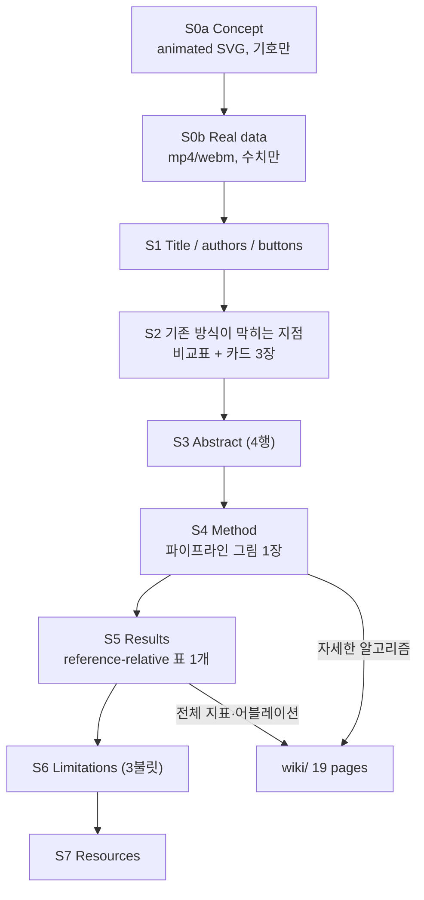
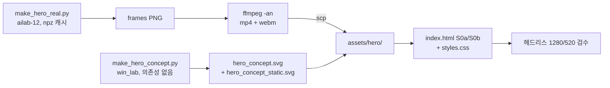

# [260921]_[Spec]_[ProjectPage_Home_v2]

프로젝트 페이지 홈(index.html) 재구성 요구사항. 대상 파일은
`C:/Users/jiwon/OneDrive/AG1_Drive/01_research/ICRA_NH_Calib/project_page/index.html`,
스타일은 같은 폴더 `styles.css`.

- v2.1 변경(2026-09-21): 히어로 제작안을 **B 단독 → B + C 둘 다**로 확정. §2 전면 개정, §1·§7 연동 수정.

---

## 0. 이 문서의 목적과 전제

- 목적: 홈을 "훑고 10초 안에 무엇을 푸는 연구인지 알게 하는 랜딩"으로 축소하고, 설명 깊이는 전부 위키로 이관.
- 근거: 동종 도메인 레퍼런스 조사 결과(ref `paper-project-page-references-20260921`) — 캘리브레이션/SLAM 도메인 프로젝트 페이지는 랜딩 1장 + 문서 사이트 조합이 사실상 유일한 차별 구조.
- 전제: 위키 19페이지(`project_page/wiki/`)는 이미 존재하고 라이브다. 홈의 역할은 요약과 진입점이지 설명서가 아니다.
- 비목표: 위키 내용의 홈 복제, 개념 튜토리얼, 데이터셋 상세, 어블레이션 표.

---

## 1. 페이지 구성(최종 순서)

| # | 섹션 | 목적 | 분량 상한 | 시각자료 |
|---|---|---|---|---|
| S0a | Hero — Concept | 원리를 도식 애니메이션으로 즉시 전달(합성) | 루프 ≤10 s | 애니메이션 SVG 1 (필수) |
| S0b | Hero — On real data | 같은 양이 실측 데이터에서 성립함을 보임 | 루프 6~10 s | 영상 1 (필수) |
| S1 | Title block | 제목·저자·기관·버튼 | 6행 | 없음 |
| S2 | Where existing calibration stops | 기존 방식의 막히는 지점 → 우리가 푸는 지점 | 표 4행 + 카드 3 | 카드 SVG 3 |
| S3 | Abstract | 논문 초록 축약 | 4행 | 없음 |
| S4 | Method | 2단 파이프라인 한 장 + 3불릿 | 8행 | 그림 1 |
| S5 | Results | **표 1개만** (reference-relative 5DoF) | 표 1 + 1행 캡션 | 그림 1 |
| S6 | Limitations | 한계 3불릿 | 5행 | 없음 |
| S7 | Resources | 논문·위키·코드·BibTeX | 링크 4 | 없음 |

- 현행 대비 변경점: S0a·S0b 신설, S5의 표를 all-pair → reference-relative 1개로 교체, S6 신설, Citation을 Resources로 흡수.
- 각 섹션 끝에는 위키 대응 페이지 링크를 1줄 두되, 섹션당 링크는 최대 2개.

---

## 2. S0 Hero — B안과 C안을 모두 채택(2단 구성)

### 2.1 이 히어로가 반드시 전달해야 하는 한 문장
> "타겟도 공시야도 없이, 차가 **선회하기만 하면** 두 센서의 궤적 길이 차이에서 장착 위치가 나온다."

### 2.2 두 패널의 역할 분담 (개정의 핵심)

| 패널 | 이전 안 | 정체 | 답하는 질문 | 표시 규칙 |
|---|---|---|---|---|
| S0a | C안 | 결정론적 애니메이션 SVG(합성 도식) | "어떤 원리인가" | **기호만** — ΔI, Δp_y, ω, ICR. 단위 붙은 수치 금지 |
| S0b | B안 | 실측 A2D2 선회 세그먼트 영상 | "실제 데이터에서도 되는가" | **수치만** — mm·deg·m 단위 readout, 데이터 출처 병기 |

- 채택 근거: C는 즉시 렌더되고 기제를 설명하며, B는 그 기제가 실측에서 성립함을 증명한다. 역할이 겹치지 않으므로 둘을 합쳐도 중복이 아니다.
- 순서 근거: 기제 → 증거. 원리를 모르는 독자가 실측 궤적 그림을 먼저 보면 무엇을 봐야 할지 모른다.
- **혼합 금지(R-C1 강화)**: S0a에는 단위 붙은 수치를 한 개도 넣지 않는다. S0b에는 합성 보조선을 넣지 않는다. 이 분리가 "합성 vs 실측" 캡션 규율을 구조적으로 보장한다.

### 2.3 배제한 배치안

| 배치 | 배제 사유 |
|---|---|
| 탭 전환(Concept / Real data) | 10초 방문자가 절반만 본다. 헤드리스 스크린샷 검증도 한쪽만 잡힌다 |
| 좌우 2열 | 최대폭 1100 px의 절반이면 R-H6(1920 기준 22 px 이상) 판독 기준 위반 |
| A안(점군 정합 before/after) | **주장 훼손** — "정합 없이 된다"는 주장에 정합 화면이 첫 장이면 자기모순. 점군 그림은 S5 검증용으로만 |

### 2.4 콘텐츠 요구사항 (R-H)

공통:

- **R-H1**: 한 번의 선회 구간을 시간 순으로 재생한다. 시청자가 "차가 돈다"를 먼저 인지해야 한다. (S0a·S0b 공통)
- **R-H2**: 화면에 센서 2개의 자기운동 궤적이 **서로 다른 색**으로 동시에 그려진다. 두 궤적은 같은 회전중심(ICR)을 공유하지만 반경이 다르다.
- **R-H3**: 누적 이동거리 차 ΔI 가 실시간 막대/기호로 같이 증가한다. 이것이 관측량임을 시각적으로 연결한다.
- **R-H6**: 텍스트는 전부 영어, 최소 폰트 크기는 1920 px 기준 22 px 이상(모바일 축소 시 판독 가능해야 함).

S0a(Concept) 전용:

- **R-H5**: 배지 3개(`no target` / `no shared FOV` / `1 of 6 DoF is time-coupled`)를 S0a 모서리에 고정 노출한다. S2 카드 3장과 문구가 **정확히 일치**해야 한다. S0b에는 배지를 반복하지 않는다.
- **R-H7**: ICR과 두 반경 차이를 명시적으로 작도한다. Δp_y 가 "두 궤적 반경의 차"임을 그림만으로 읽히게 한다.
- **R-H8**: 좌선회 1회 + 우선회 1회를 한 루프에 담아 ΔI 부호가 뒤집히는 것을 보인다(부호 게이지가 우리 방법의 구성요소이므로).

S0b(Real data) 전용:

- **R-H4**: 재생 후반에 추정값 Δp_y 가 수렴하는 수치 readout 과 GT 값이 함께 표시된다. 오차를 숨기지 않는다.
- **R-H9**: 캡션에 데이터셋·드라이브·센서쌍을 명시한다(예: A2D2 20180810_150607, FRONT_LEFT ↔ FRONT_RIGHT).
- **R-H10**: 표시 세그먼트는 논문·위키에서 쓴 것과 동일한 게이트(선회 검출 임계값)를 통과한 세그먼트여야 한다. 히어로용으로 따로 고른 예외 구간을 쓰지 않는다.

### 2.5 기술 요구사항 — S0a Concept (R-TA)

- **R-TA1** 포맷: 단일 SVG, **JS 없음**. 애니메이션은 SMIL 또는 SVG 내부 `<style>`의 CSS keyframes로만 구현.
- **R-TA2** 삽입: ``. `<object>`·iframe 사용 금지.
- **R-TA3** 감속 대응: 정적 변형 `hero_concept_static.svg`(루프 종료 상태 = 두 궤적 완성 + ΔI 최대)를 함께 만들고
  `<picture><source media="(prefers-reduced-motion: reduce)" srcset="hero_concept_static.svg"></picture>` 로 교체한다.
  SVG 내부 미디어쿼리에만 의존하지 않는다(SVG-as-image 의 사용자 선호 상속은 브라우저별로 보장되지 않음).
- **R-TA4** 용량: ≤ 200 KB. viewBox 16:9, 폭 100%, 최대폭 1100 px.
- **R-TA5** 루프 8 s, 무한 반복. 좌선회 3.5 s → 전환 1 s → 우선회 3.5 s.
- **R-TA6** 생성기: `project_page/tools/make_hero_concept.py` (win_lab 로컬, 외부 의존성 없이 순수 문자열 작도 — 기존 `make_card_figures.py` 와 같은 작법).

### 2.6 기술 요구사항 — S0b Real data (R-TB)

- **R-TB1** 포맷: `.mp4`(H.264, yuv420p) + `.webm` 병기. `<video autoplay muted loop playsinline preload="metadata">`.
- **R-TB2** 용량: mp4 ≤ 4 MB, webm ≤ 3 MB, poster ≤ 300 KB. 히어로 자산 총합 ≤ 7 MB.
- **R-TB3** 길이 6~10 초 무한 루프, 25 fps 이상. **오디오 스트림 0개**(자동재생 차단 회피). ffmpeg 인자에 `-an` 명시.
- **R-TB4** `poster="assets/hero/hero_real_poster.png"` — 포스터는 **루프 마지막 프레임**(궤적 완성 + Δp_y 수렴 readout + GT)으로 한다. 영상 로드 실패 시 포스터 한 장만으로 주장이 성립해야 하므로 첫 프레임을 쓰지 않는다.
- **R-TB5** `@media (prefers-reduced-motion: reduce)` 에서는 `<video>`를 숨기고 poster PNG를 표시한다.
- **R-TB6** 종횡비 16:9, 폭 100%, 최대폭 1100 px. 모바일 520 px 에서 readout 텍스트가 잘리지 않아야 한다.
- **R-TB7** `aria-label` + 하단 1줄 캡션(R-H9 내용 + 표시 수치의 정의).
- **R-TB8** 제작 호스트: **ailab-12**. 근거 — A2D2 pose/twist 캐시(`/media/ailab-12/3580-E7B41/nh_cache/a2d2_20180810_150607`, 읽기전용)와 `ffmpeg`(`/usr/bin/ffmpeg`)이 그곳에만 있다. win_lab 에는 ffmpeg 이 없다(2026-09-21 확인).
- **R-TB9** 파이프라인: `tools/make_hero_real.py`(ailab-12에서 실행) → matplotlib 프레임 PNG → ffmpeg 인코딩 → `scp` 로 win_lab `project_page/assets/hero/` 에 회수. 스크립트는 저장소에 두고 재생성 가능해야 한다.
- **R-TB10** 폴백: B 렌더가 막히면 S0b 를 삭제하고 S0a 단독으로 간다. **S0a 를 실측처럼 캡션하는 방식으로 대체하지 않는다.**

### 2.7 캡션 규율 (R-C)

- **R-C1** S0a 캡션은 `Schematic, synthetic values` 로 시작한다. S0b 캡션은 데이터셋·드라이브·센서쌍으로 시작한다. 두 문구를 섞지 않는다.
- **R-C2** 표시하는 Δp_y 수치는 논문 표와 같은 프로토콜(reference-relative)이어야 한다. 다른 프로토콜 수치를 히어로에 쓰지 않는다.
- **R-C3** 두 패널 사이에 연결 문장 1줄을 둔다(예: `The same quantity, measured on real drive data:`). 패널 2개가 각각 무엇인지 스크롤만으로 구분되게 한다.

---

## 3. S2 Problem 섹션 요구사항

- 비교표 4행(target-based / registration-based / hand-eye / ours) × 3열(타겟 필요 / 공시야 필요 / 시간정렬 결합 DoF)을 유지한다.
- Target-based 의 시간정렬 칸은 우리 우위로 쓰지 않고 `static capture` 로 정직 표기한다(기존 판단 유지).
- 카드 3장은 글 위·그림 아래, 데스크톱 3열·900 px 이하 1열(현행 유지).
- 카드 SVG는 유저가 재작업 예정 — 경로 3개(`assets/cards/card{1,2,3}-*.svg`)는 유지하고 `tools/make_card_figures.py` 재실행으로 덮어쓰지 않도록 주의.
- S0a 배지 문구와 카드 3장의 제목은 동일 문자열을 쓴다(R-H5). 한쪽만 고치지 않는다.

---

## 4. S5 Results 요구사항 (기존 결함 해소)

- **필수 수정**: 현재 홈 표는 all-pair 평균, 논문·위키는 reference-relative 지표라 값이 다르다. 홈 표를 **reference-relative 로 교체**하고 임시 경고문을 제거한다.
- 표에는 지표 정의를 1줄로 병기한다: 지표 = 기준 센서 대비 상대 외부파라미터의 절대오차 평균(MAE) [mm, deg], GT는 데이터셋 제공 외부파라미터.
- 행 수 상한 6. 전체 15행 표는 위키 `results.html` 로 링크만 건다.
- 그림 1장만 둔다(권고: `localmap-covisibility.jpg` 가 아니라 pair error matrix 계열 — 정합 오해 회피).

---

## 5. S6 Limitations 요구사항

3불릿 고정, 각 1줄:
- p_z 는 평면 운동에서 미관측 — 우리 한계가 아니라 운동의 성질임을 명시.
- 선회 자극이 없는 주행(고속도로 직진 위주)에서는 Δp_y 가 약해진다.
- 슬립계수 c 는 nuisance parameter 로 추정할 뿐, 물리적 슬립 모델을 주장하지 않는다.

---

## 6. 금지사항 (가드레일)

- "시간동기에 강건하다" 라고 쓰지 않는다. → "6 DoF 중 1개만 센서 간 시간정렬에 결합된다" 로만 쓴다.
- 공시야 중첩률 수치를 주장 근거로 쓰지 않는다(정성 그림만).
- p_z 미관측을 우리 방법의 우위처럼 쓰지 않는다.
- 등속 + 슬라럼 단일 센서 p_y 추정을 제안하지 않는다.
- 히어로에 점군 정합 before/after 를 쓰지 않는다(§2.3 A안 사유).
- S0a(합성)에 단위 붙은 수치를 쓰지 않는다. 합성 도식이 실측 증거로 오독될 여지를 남기지 않는다.

---

## 7. 완료 기준 (검증 가능한 형태)

1. 1280 px 및 520 px 헤드리스 렌더에서 **S0a 정지 프레임**에 배지 3개와 궤적 2개, ICR 표기가 모두 보인다.
2. 같은 렌더에서 **S0b 포스터**에 두 궤적과 Δp_y·GT readout 이 모두 보이고, 텍스트 잘림이 없다.
3. mp4 ≤ 4 MB, webm ≤ 3 MB, 오디오 스트림 0개(ailab-12 `ffprobe` 로 확인 — win_lab 에는 없음). 히어로 자산 총합 ≤ 7 MB.
4. `prefers-reduced-motion: reduce` 에뮬레이션에서 S0a 는 `hero_concept_static.svg`, S0b 는 poster PNG 가 표시되고 애니메이션이 정지한다.
5. S0a 안의 문자열 중 단위 포함 수치(`mm`, `deg`, `m/s`)가 0건이다(SVG 텍스트 grep 으로 확인).
6. S0a 배지 3개 문구가 S2 카드 3장 제목과 문자열 단위로 일치한다(불일치 0건).
7. S5 표의 모든 수치가 위키 `results.html` 의 reference-relative 표와 일치한다(불일치 0건).
8. 링크·에셋 검사 0 문제(`tools/build_wiki.py` 검사기 + 홈 자산 존재 확인).
9. 홈 페이지 전체 스크롤 길이가 현행 대비 줄어든다(표 1개·그림 4장 이하, 히어로 2패널은 이 계수에서 제외).

---

## 8. 실행 순서(제작 계획)

- S0a 와 S0b 는 서로 독립이므로 병렬 진행 가능하다. S0a 가 먼저 끝나면 그 상태로 커밋 가능(S0b 는 추가 커밋).
- ailab-12 렌더는 본 턴 안에 끝나지 않을 수 있다 — 장시간이면 독립 프로세스로 띄우고 작업 대장에 등록한다.
